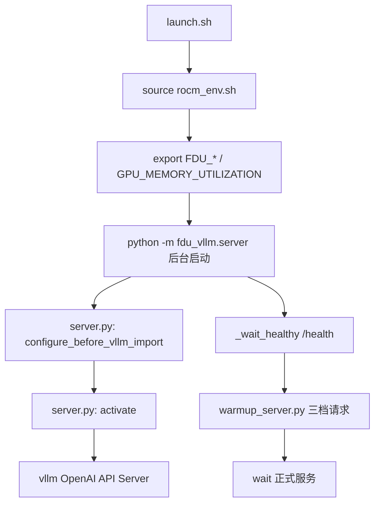

# 代码阅读学习指南

> **适用对象**：零基础入门、需要系统读懂本仓库的同学  
> **仓库定位**：2026 先导杯 · 基于 DCU 的 Qwen3.5-27B 推理优化（vLLM 0.18.1 插件）  
> **预计总时长**：分 5 个阶段，每阶段 2–6 小时（视基础而定）

---

## 0. 开始之前：这份指南怎么用

### 0.1 学习目标

读完并按本指南实践后，你应能回答：

1. 一次 HTTP 请求从 `launch.sh` 到 vLLM 出 token，经过了哪些文件？
2. Prefill / Decode 分别影响 TTFT 还是 TPOT？
3. `fdu_vllm` 插件挂了哪些优化？哪些已实装、哪些仍是骨架？
4. 赛题允许改什么、禁止改什么？
5. 若要做下一项优化，应改哪个文件、如何验证？

### 0.2 配套文档（先收藏）

| 文档 | 何时读 |
|------|--------|
| [../README.md](../README.md) | 第 0 天：项目全景 |
| [easy_scoring.md](./easy_scoring.md) | 第 1 天：知道「先动哪里能拿分」 |
| [env_vars.md](./env_vars.md) | 读 `config.py` / `rocm_env.sh` 时对照 |
| [optimization_roadmap.md](./optimization_roadmap.md) | 读完阶段 2 后：优化优先级与赛程 |
| [official_guidance_interpretation.md](./official_guidance_interpretation.md) | 读完阶段 1 后：官方考核口径 |
| [../report.md](../report.md) | 提交前：优化方案说明模板 |
| [submit_checklist.md](./submit_checklist.md) | 上机评测前 |

### 0.3 阅读原则

- **先链路、后模块、再 kernel**：不要一上来读 `dcu_flash_attn.cpp`。
- **对照 Baseline**：优化版与 `baseline/launch.sh` 的差异 = 插件价值。
- **带着指标读**：每段代码问一句——它主要帮 TTFT、TPOT，还是吞吐/显存？
- **诚实区分「已实现」与「骨架」**：见本文 [附录 A](#附录-a-实现状态速查表)。

---

## 1. 前置知识（可边读边补）

不必全部学完再动手，但以下概念会在代码里反复出现：

| 概念 | 一句话 | 在本仓库哪里体现 |
|------|--------|------------------|
| Token | 模型处理的最小文本单元 | warmup 按字符近似 token |
| Prefill | 一次性处理整段 prompt | 影响 **TTFT** |
| Decode | 每步只生成 1 个新 token | 影响 **TPOT**、吞吐量 |
| KV Cache | 每层 Attention 存下的 K/V，供后续 token 读取 | `kv_cache/`、`kv_fp8.py` |
| PagedAttention | KV 按 block 分页存储 | `block_allocator.py` |
| GQA | Q head 多、KV head 少（64/32） | `gqa_decode.py` |
| 算子 (Operator) | GPU 上的一次数学运算（MatMul、Attention 等） | `attention/`、`dcu_flash_attn.cpp` |
| SLA 熔断 | TTFT/TPOT P99 超 Baseline×1.5 → 该档得分清零 | `launch.sh`、`warmup_server.py` |
| DCU / ROCm / HIP | 国产加速卡及其编程栈 | `rocm_env.sh`、`dcu_attention.py` |

**推荐外部阅读（各 30 分钟量级）：**

- vLLM PagedAttention 科普（官方博客或文档 Prefill/Decode 章节）
- FlashAttention 论文图解（理解「分块 + online softmax」即可，不必推公式）

---

## 2. 五阶段学习路径

```
阶段 0 ─ 比赛与仓库地图（懂「比什么」）
阶段 1 ─ 启动链路（懂「程序怎么跑起来」）
阶段 2 ─ 插件总线 fdu_vllm（懂「优化怎么挂上去」）
阶段 3 ─ 三大优化轴源码（懂「每一块在干什么」）
阶段 4 ─ 脚本、评测与合规（懂「怎么验、什么不能动」）
阶段 5 ─ 进阶：HIP kernel 与实机调试（懂「怎么继续提分」）
```

每阶段末尾有 **自检清单** 和 **动手练习**。

---

## 阶段 0：比赛与仓库地图（约 2h）

### 0.1 必读材料

1. 仓库根目录 [参赛说明.txt](../../参赛说明.txt) 或 [官方-赛题技术方案.md](../../官方-赛题技术方案.md) — 评分公式、三档权重、禁止项  
2. [../README.md](../README.md) — 项目结构树  
3. [easy_scoring.md](./easy_scoring.md) — 当前默认开启的 P0/P1 项  

### 0.2 核心结论（背下来）

```
最终得分 = 吞吐量得分 × 精度系数

三档权重：4–8K (20%) · 8–16K (50%) · 16–32K (30%)

硬性 SLA（任一超标 → 该档吞吐分清零）：
  TTFT P99 ≤ Baseline × 1.5（分档）
  TPOT P99 ≤ Baseline × 1.5（全局）

初赛并发 = 1 → 不能靠改 batch scheduler 提分
```

### 0.3 目录心智模型

```
baseline/
├── launch.sh                 # 优化版入口（评测用）
├── baseline/launch.sh        # 纯净 vLLM（对照）
├── config.yaml               # 插件开关默认值
├── scripts/                  # 编译、评测、预热、门禁
└── src/
    ├── fdu_vllm/             # ★ 插件入口（先读这里）
    ├── kv_cache/             # KV 块管理
    ├── attention/            # Attention + HIP kernel
    ├── quantization/         # KV FP8 算法
    ├── executor/             # HIP Graph
    ├── scheduler/            # ⚠ 已废弃，赛题禁用
    └── utils/                # Profiling 工具
```

### 自检清单

- [ ] 能说出 8–16K 档为什么权重最高（50%）
- [ ] 能区分「提吞吐」和「防 SLA 熔断」两类改动
- [ ] 知道 `baseline/launch.sh` 与 `launch.sh` 的区别

### 动手练习

在纸上画一条时间线：`HTTP 请求 → 首 token → 后续 token → 结束`，标出 TTFT 和 TPOT 各对应哪一段。

---

## 阶段 1：启动链路（约 3h）

**目标**：跟完「从 shell 到 vLLM 监听 8000 端口」的全路径。

### 1.1 推荐阅读顺序

| 顺序 | 文件 | 关注点 |
|------|------|--------|
| 1 | [../launch.sh](../launch.sh) | 环境变量、vLLM CLI 参数、warmup 流程 |
| 2 | [../scripts/rocm_env.sh](../scripts/rocm_env.sh) | `FDU_*` 开关默认值 |
| 3 | [../src/fdu_vllm/server.py](../src/fdu_vllm/server.py) | 三行：`vllm_env` → `activate` → `vllm_main` |
| 4 | [../src/fdu_vllm/vllm_env.py](../src/fdu_vllm/vllm_env.py) | 必须在 import vllm **之前**执行 |
| 5 | [../src/fdu_vllm/__main__.py](../src/fdu_vllm/__main__.py) | `python -m fdu_vllm.server` 的入口 |
| 6 | [../scripts/warmup_server.py](../scripts/warmup_server.py) | 三档 `_PROFILES` 与 TTFT 稳定 |
| 7 | [../baseline/launch.sh](../baseline/launch.sh) | 对照：无插件、gpu=0.92、无 warmup |

### 1.2 启动流程图（建议对照代码看）



### 1.3 关键代码锚点

**`launch.sh` 第 31–32 行** — KV FP8 默认关，保精度系数：

```bash
export FDU_ENABLE_KV_QUANT="${FDU_ENABLE_KV_QUANT:-0}"
```

**`server.py`** — 插件与 vLLM 的缝合点：

```python
configure_before_vllm_import()
activate()
vllm_main()
```

**`warmup_server.py` `_PROFILES`** — 与官方三档对齐的预热规模。

### 自检清单

- [ ] 能解释为什么 warmup 在 `activate()` 之后、对外服务之前
- [ ] 能列出 `launch.sh` 相对 `baseline/launch.sh` 的 5 处差异
- [ ] 知道 `--enable-prefix-caching` 何时被加入（`FDU_ENABLE_PREFIX_CACHE`）

### 动手练习

1. 用 `grep -r "FDU_ENABLE" launch.sh scripts/rocm_env.sh src/fdu_vllm/config.py` 列出所有 FDU 开关及默认值。  
2. 阅读 [env_vars.md](./env_vars.md)，为每个变量写一句「改了会影响什么指标」。

---

## 阶段 2：插件总线 `fdu_vllm`（约 4h）

**目标**：理解 `activate()` 如何按配置挂载子模块。

### 2.1 推荐阅读顺序

| 顺序 | 文件 | 关注点 |
|------|------|--------|
| 1 | [../config.yaml](../config.yaml) | 默认开关与合规注释 |
| 2 | [../src/fdu_vllm/config.py](../src/fdu_vllm/config.py) | yaml + 环境变量合并逻辑 |
| 3 | [../src/fdu_vllm/hooks.py](../src/fdu_vllm/hooks.py) | **`activate()` 总调度** |
| 4 | [../src/fdu_vllm/__init__.py](../src/fdu_vllm/__init__.py) | 对外 API |
| 5 | [../src/fdu_vllm/vllm_worker.py](../src/fdu_vllm/vllm_worker.py) | 仅日志，不改 scheduler |

### 2.2 `activate()` 决策树

阅读 `hooks.py` 时按此树跟踪：

```
cfg.enable == False?  → 直接返回，等同 Baseline

cfg.enable_kv_quant?  → KVQuantHooks.install()

cfg.kv_strategy in (defrag, ...)?  → install_kv_hooks()

cfg.attention_backend == dcu_optimized?  → install_attention_hooks()

cfg.enable_hip_graph?  → install_hip_graph_hooks()

最后 → patch_worker_if_available()（best-effort）
```

### 2.3 配置优先级（易考）

```
环境变量  >  config.yaml  >  config.py 代码默认值
```

例：`launch.sh` 设 `FDU_ENABLE_KV_QUANT=0` 会覆盖 yaml 里的 `enable_kv_quant: false`（两者一致时以 launch 为准）。

### 自检清单

- [ ] 能默画 `activate()` 的 if 分支顺序
- [ ] 能解释 `is_active()` 的用途
- [ ] 知道 `vllm_worker.py` **没有**改 batch scheduler 的原因（赛题禁止）

### 动手练习

在 `hooks.py` 每个分支旁手写注释：影响的指标（TTFT / TPOT / 吞吐 / 精度）、当前实现状态（见附录 A）。

---

## 阶段 3：三大优化轴源码（约 8–12h）

按 **风险低 → 高**、**已实现 → 骨架** 顺序阅读。

---

### 3.1 轴一：KV Cache 与显存（约 3h）

| 顺序 | 文件 | 难度 | 说明 |
|------|------|------|------|
| 1 | [../src/kv_cache/block_allocator.py](../src/kv_cache/block_allocator.py) | ★★ | 分级块、defrag、连续分配 |
| 2 | [../src/kv_cache/cache_manager.py](../src/kv_cache/cache_manager.py) | ★★ | prefix 哈希、watermark |
| 3 | [../src/fdu_vllm/kv_cache.py](../src/fdu_vllm/kv_cache.py) | ★ | 插件安装 + wrap_kv_read/write |

**阅读提示：**

- `allocate()` → `_select_tier()` → `_alloc_contiguous()` → 可能 `defragment()`，跟完一条调用链。
- `find_prefix()` / `cache_prefix()` 用 `hash(tuple(token_ids[:256]))`，理解局限性（碰撞、仅前 256 token）。
- `reserve_decode_headroom()` 与 `gpu_memory_utilization=0.94` 目标一致：长上下文别 OOM。

**与 vLLM 的关系：** 当前为**自研分配器框架**；深度替换 vLLM 内部分配器需后续 wiring（见附录 A）。

---

### 3.2 轴二：KV FP8 量化（约 2h）

| 顺序 | 文件 | 难度 |
|------|------|------|
| 1 | [../src/quantization/kv_quant.py](../src/quantization/kv_quant.py) | ★★ |
| 2 | [../src/fdu_vllm/kv_fp8.py](../src/fdu_vllm/kv_fp8.py) | ★ |

**阅读提示：**

- 抓住 `quantize` 三行：`amax` → `scale` → `clamp` → `float8_e4m3fn`。
- `estimate_memory_savings()` 理解「约省 50% KV 显存」从哪来。
- 赛题允许：**在线、非持久化**；禁止：权重持久化量化。

**验证路径：** 开启 `FDU_ENABLE_KV_QUANT=1` 后必须跑 `scripts/gate_check.sh full`（精度 Δ≤1%）。

---

### 3.3 轴三：Attention 与 GQA（约 4h）★ 重点

| 顺序 | 文件 | 难度 | 说明 |
|------|------|------|------|
| 1 | [../src/fdu_vllm/gqa_decode.py](../src/fdu_vllm/gqa_decode.py) | ★★ | **最短、最完整的优化逻辑** |
| 2 | [../src/fdu_vllm/attention.py](../src/fdu_vllm/attention.py) | ★★ | 安装 backend + patch forward |
| 3 | [../src/attention/dcu_attention.py](../src/attention/dcu_attention.py) | ★★★ | 双路径、JIT 编译、fallback |
| 4 | [../src/attention/hip_kernels/dcu_flash_attn.cpp](../src/attention/hip_kernels/dcu_flash_attn.cpp) | ★★★★ | HIP kernel 骨架 |

**`gqa_decode.py` 精读步骤：**

1. 看 `num_q_heads == num_kv_heads` 分支（标准 MHA）。
2. 看 `repeat_interleave` fallback（不能整除时）。
3. 重点看 `einsum` 路径：`view` → `scores` → `softmax` → `out`。
4. 理解为何 Decode（T=1）仍省带宽：避免物化重复 KV。

**`dcu_attention.py` 精读步骤：**

1. 常量：`WAVEFRONT_SIZE`、`LDS_SIZE`、`TILE_Q/KV` — 对应 DCU 硬件。
2. `load_hip_kernel()` — `load_inline` JIT 流程。
3. `forward()` → `_forward_hip()` vs `_forward_torch()`。
4. **注意** `_forward_hip()` 当前仍 fallback（待 SCNet 验证）。

**`dcu_flash_attn.cpp` 精读步骤（进阶）：**

1. `__shared__` LDS 三分区（Q/K/V）共 64KB。
2. `for (kv_start ...)` 外循环 = FlashAttention 分块。
3. 注释中的 online softmax 与 MFMA 四步对应论文图。
4. 识别「已实现」vs「注释占位」的代码块。

---

### 3.4 轴四：执行路径 / HIP Graph（约 2h）

| 顺序 | 文件 | 难度 |
|------|------|------|
| 1 | [../src/executor/exec_path.py](../src/executor/exec_path.py) | ★★★ |
| 2 | [../src/fdu_vllm/hip_graph.py](../src/fdu_vllm/hip_graph.py) | ★ |

**阅读提示：**

- ROCm 上 `torch.cuda.CUDAGraph` 映射为 HIP Graph（文件头注释必读）。
- `capture_graph()` 先 warmup 3 次再 capture 的原因。
- 默认 `FDU_ENABLE_HIP_GRAPH=0`：并发=1 时收益不确定，稳定性优先。

---

### 3.5  deliberately 跳过（除非做历史考古）

| 文件 | 原因 |
|------|------|
| [../src/scheduler/custom_scheduler.py](../src/scheduler/custom_scheduler.py) | 赛题禁止改 batch scheduler；模块已标记 DEPRECATED |
| [../baseline/baseline/](../baseline/baseline/) | 嵌套备份，以根目录 `baseline/launch.sh` 为准 |

---

### 阶段 3 自检清单

- [ ] 能白板画出 GQA einsum 的 tensor 形状变化
- [ ] 能解释 FlashAttention 为何比朴素 Attention 省显存
- [ ] 知道 KV FP8 开与关各影响什么分数维度
- [ ] 能指出 `_forward_hip()` 当前实际走哪条路径

### 阶段 3 动手练习

1. **代码追踪**：从 `install_attention_hooks()` 跟到 `gqa_scaled_dot_product_attention()`，列出函数调用栈。  
2. **参数计算**：Qwen3.5-27B，上下文 16K，估算 KV Cache bf16 占用（层数×2×32 heads×128 dim×16K×2 bytes）。  
3. **对比阅读**：并排打开 `gqa_decode.py` 的 einsum 路径与 `dcu_attention.py` 的 `repeat_interleave` 路径，写 3 条优劣对比。

---

## 阶段 4：脚本、评测与合规（约 3h）

### 4.1 推荐阅读顺序

| 文件 | 用途 |
|------|------|
| [../scripts/gate_check.sh](../scripts/gate_check.sh) | 精度/性能门禁 |
| [../scripts/benchmark.py](../scripts/benchmark.py) | 本地三档压测 |
| [../scripts/compare.py](../scripts/compare.py) | Baseline vs Optimized 对比 |
| [../scripts/compile_kernels.sh](../scripts/compile_kernels.sh) | HIP kernel 编译 |
| [../scripts/compile_vllm.sh](../scripts/compile_vllm.sh) | vLLM + 补丁编译 |
| [../scripts/verify_token_consistency.py](../scripts/verify_token_consistency.py) | token 一致性 |
| [submit_checklist.md](./submit_checklist.md) | 提交前检查 |

### 4.2 合规红线（读代码时随时对照）

| ✅ 允许 | ❌ 禁止 |
|---------|---------|
| 环境变量、`launch.sh` 合法参数 | 改 `max-num-seqs`、`max-num-batched-tokens` |
| 自定义 HIP kernel、在线 KV FP8 | 改权重、持久化量化、投机解码 |
| `fdu_vllm` 插件 hook | 修改 vLLM batch scheduler |
| prefix caching（vLLM 官方参数） | 截断输入、预缓存答案 |

### 4.3 工具层（可选）

[../src/utils/profiling.py](../src/utils/profiling.py) — 本地测 TTFT/TPOT；`RequestProfiler` 适合写小型实验脚本。

### 自检清单

- [ ] 能说出提交评测时平台只执行哪个脚本（`launch.sh`）
- [ ] 知道门禁 `quick` 与 `full` 的区别
- [ ] 能解释为何 README 强调 `changelog.md` 和 `env_vars.md`

---

## 阶段 5：进阶与实机（约 6h+）

### 5.1 建议阅读

| 文档/文件 | 内容 |
|-----------|------|
| [optimization_roadmap.md](./optimization_roadmap.md) | 全队优先级与阶段门禁 |
| [deep_optimization_guide.md](./deep_optimization_guide.md) | 深度提分路径 |
| [dcu_decode_benchmark_interpretation.md](./dcu_decode_benchmark_interpretation.md) | DCU decode 带宽墙结论 |
| [SCNET_RUN.md](./SCNET_RUN.md) | 实机操作流程 |
| [../patches/vllm_cscc/README.md](../patches/vllm_cscc/README.md) | vLLM 补丁说明 |

### 5.2 进阶任务（按优先级）

1. **SCNet 跑通** `record_baseline.sh` → 填 [report.md](../report.md) 实测表  
2. **Profiling**：Decode 瓶颈在权重 IO 还是 Attention（决定 FlashAttention 投入比例）  
3. **接通 `_forward_hip()`**：kernel API 与 `block_tables` / `context_lens`  
4. **KV FP8 融合**：write 量化 + attention 内 dequant，避免独立反量化开销  
5. **HIP Graph**：在 decode 固定 shape 路径 capture/replay  

### 5.3 推荐阅读顺序（全仓库「第二次通读」）

适合已跑通 SCNet、准备改代码的同学：

```
gqa_decode.py → attention.py → dcu_attention.py
    → kv_cache/* → kv_fp8 + kv_quant
    → exec_path.py → dcu_flash_attn.cpp
    → patches/vllm_cscc → vllm_worker.py
```

---

## 附录 A：实现状态速查表

读代码时避免「以为已经生效」。下表截至文档编写时仓库状态，实机以 SCNet 日志为准。

| 模块 | 代码位置 | 逻辑完整度 | 与 vLLM 深度集成 |
|------|----------|------------|------------------|
| launch 参数 + warmup | `launch.sh`, `warmup_server.py` | ✅ 完整 | ✅ 直接使用 |
| ROCm 环境变量 | `rocm_env.sh`, `vllm_env.py` | ✅ 完整 | ✅ |
| Prefix caching | `launch.sh` CLI | ✅ 完整 | ✅ vLLM 原生 |
| GQA einsum | `gqa_decode.py` | ✅ 完整 | ⚠️ patch 到 backend.forward |
| KV block/defrag | `kv_cache/*` | ✅ 逻辑完整 | ⚠️ 框架，待 wiring |
| KV FP8 | `kv_quant.py`, `kv_fp8.py` | ✅ 算法完整 | ⚠️ install 以日志为主 |
| HIP FlashAttention | `dcu_flash_attn.cpp` | ⚠️ 骨架 | ❌ `_forward_hip` fallback |
| HIP Graph | `exec_path.py` | ✅ API 完整 | ⚠️ 未挂主路径 |
| Custom scheduler | `custom_scheduler.py` | — | ❌ 禁用 |

---

## 附录 B：文件 → 指标映射表

改代码前先查「动这里会影响什么」：

| 文件/开关 | 主攻指标 | 风险 |
|-----------|----------|------|
| `GPU_MEMORY_UTILIZATION=0.94` | 8–16K/16–32K 吞吐 | OOM |
| `warmup_server.py` | TTFT P99 | 启动变慢 |
| `--enable-prefix-caching` | TTFT（共享前缀） | 低 |
| `gqa_decode.py` | TPOT P99 | 低 |
| `kv_cache/defrag` | 长档 TPOT、稳定性 | 中 |
| `FDU_ENABLE_KV_QUANT=1` | 长档吞吐 | 精度系数 |
| `dcu_flash_attn.cpp` | Prefill TTFT / Attention | 中–高 |
| `FDU_ENABLE_HIP_GRAPH=1` | TPOT P99 | 稳定性 |

---

## 附录 C：一周学习计划（示例）

| 天 | 内容 | 产出 |
|----|------|------|
| D1 | 阶段 0 + 阶段 1 | 手绘启动流程图 |
| D2 | 阶段 2 | `activate()` 注释版笔记 |
| D3 | 3.1 KV Cache + 3.2 FP8 | 显存估算练习 |
| D4 | 3.3 GQA + attention.py | 调用栈文档 |
| D5 | dcu_attention.py + cpp 导读 | FlashAttention 笔记 |
| D6 | 阶段 4 + SCNET_RUN | 跑 quick 门禁 |
| D7 | 阶段 5 + report 填表 | 一项优化的 A/B 记录 |

---

## 附录 D：常见问题

**Q：应该先读 Python 还是先读 C++？**  
A：先 Python。`gqa_decode.py` → `dcu_attention.py` → 最后 `dcu_flash_attn.cpp`。

**Q：`fdu_vllm` 和 `src/kv_cache` 为什么两套？**  
A：`fdu_vllm/` 是 vLLM 插件入口（薄封装）；`src/kv_cache` 等是具体算法实现，由 `hooks.py` 导入。

**Q：Baseline 和 Optimized 代码差在哪？**  
A：Optimized 多走 `python -m fdu_vllm.server` → `activate()`，且 `launch.sh` 参数更激进（gpu 0.94、warmup、关日志等）。

**Q：并发=1 还要读 scheduler 吗？**  
A：不必。`custom_scheduler.py` 仅作架构参考，赛题禁止启用。

**Q：如何确认某项优化真的生效？**  
A：看日志（`FDU plugin active`）、SCNet `gate_check`、对比 `benchmark.py` / 平台吞吐，勿只看代码「调用了」。

---

## 附录 E：推荐阅读记录模板

复制到个人笔记，每读完一文件填一行：

```markdown
| 日期 | 文件 | 一句话总结 | 影响指标 | 疑问 |
|------|------|------------|----------|------|
| | launch.sh | | TTFT/TPOT | |
| | hooks.py | | | |
| | gqa_decode.py | | TPOT | |
```

---

*文档维护：随 `report.md` 阶段状态更新附录 A；重大架构变更时同步修订阶段 3 阅读顺序。*
